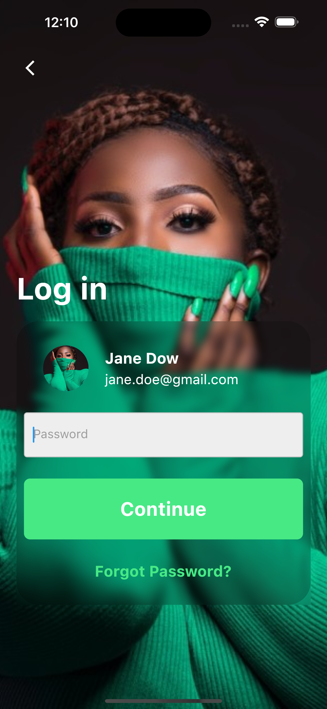

# DRIBBLE AUTH UI
    
<a href="https://dribbble.com/shots/15266900-Mobile-app-login-screen-and-sign-up-flow?utm_source=Clipboard_Shot&utm_campaign=nicodin&utm_content=Mobile%20app%20login%20screen%20and%20sign%20up%20flow&utm_medium=Social_Share&utm_source=Clipboard_Shot&utm_campaign=nicodin&utm_content=Mobile%20app%20login%20screen%20and%20sign%20up%20flow&utm_medium=Social_Share" target="_blank"> Design</a>
 
  
## Description
Login and signup app with Flutter inspired by a UI design seen on Dribble.
 
Star this repository and follow me on github 

## Requirements
- Flutter 3.3.10 ou supérieur

## Installation
-- flutter pub get
-- flutter run

## Screenshots
<table>
  <tr>
    
    
    
  </tr>
</table>

